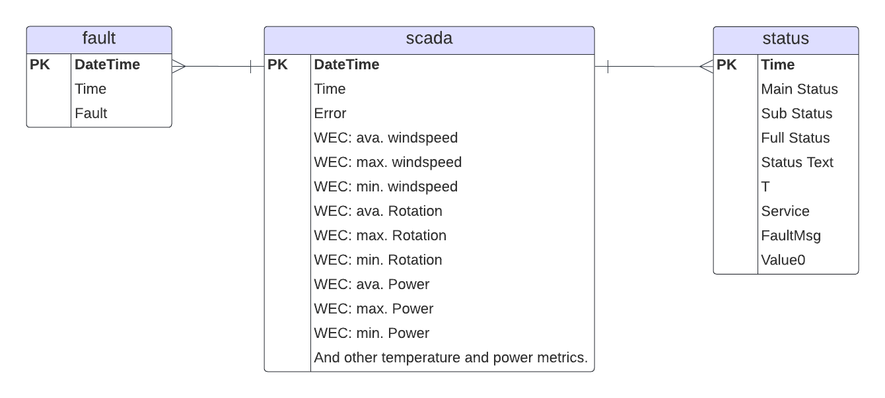

## Entity-Relationship Diagram (ERD)

### Datasets and Attributes

1. **SCADA Data**
   - **Attributes**: `DateTime` (Primary Key), `Time`, `Error`, `WEC: ava. windspeed`, `WEC: max. windspeed`, `WEC: min. windspeed`, `WEC: ava. Rotation`, `WEC: max. Rotation`, `WEC: min. Rotation`, `WEC: ava. Power`, `WEC: max. Power`, `WEC: min. Power`, and other temperature and power metrics (66 attributes in total).
   - **Primary Key**: `DateTime`

2. **Status Data**
   - **Attributes**: `Time` (Primary Key), `Main Status`, `Sub Status`, `Full Status`, `Status Text`, `T`, `Service`, `FaultMsg`, `Value0`
   - **Primary Key**: `Time`

3. **Fault Data**
   - **Attributes**: `DateTime` (Primary Key), `Time`, `Fault`
   - **Primary Key**: `DateTime`

### Diagram

